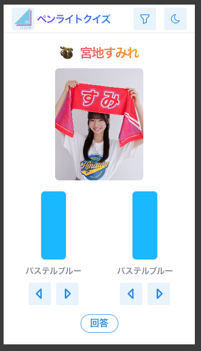
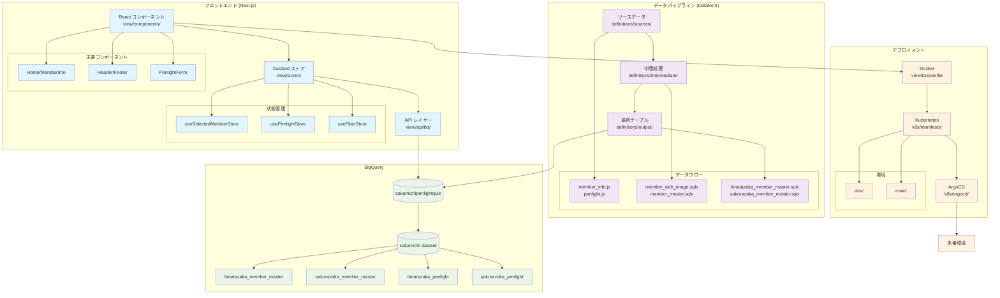
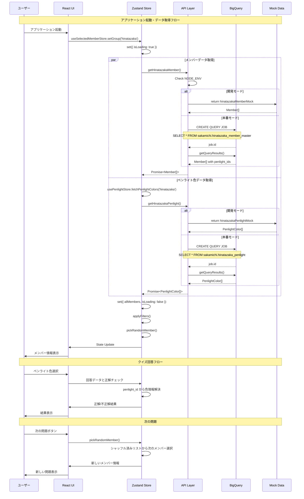

# 坂道グループペンライトクイズ

[](https://github.com/AobaIwaki123/sakamichi-penlight-quiz/actions/workflows/ci.yml)


Deep Wiki: https://deepwiki.com/AobaIwaki123/sakamichi-penlight-quiz

<div style="display: flex; justify-content: center; gap: 10px;">
  
</div>

## 注意

レスポンシブ対応が苦手すぎて、横画面のレイアウトはかなり崩れています。
是非縦画面で楽しんでください。

## プロジェクト全体アーキテクチャ



## BigQueryデータ取得シーケンス図



## 技術スタック

- **フロントエンド**: Next.js 15 (App Router)
- **UI ライブラリ**: Mantine UI v7.17.4
- **状態管理**: Zustand v5.0.3
- **データベース**: BigQuery
- **データパイプライン**: Dataform
- **デプロイ**: Kubernetes + ArgoCD
- **開発**: Docker Compose

## プロジェクト構成

### ディレクトリ構造

```
sakamichi-penlight-quiz/
├── view/                          # Next.jsフロントエンドアプリケーション
│   ├── app/                       # App Router (Next.js 15)
│   │   ├── page.tsx              # ホームページ
│   │   ├── layout.tsx            # ルートレイアウト
│   │   └── error.tsx             # エラーページ
│   ├── components/               # Reactコンポーネント
│   │   ├── Home/                 # メインクイズUI
│   │   │   ├── Home.tsx         # メインコンポーネント
│   │   │   ├── MemberInfo/      # メンバー情報表示
│   │   │   └── PenlightForm/    # ペンライト選択フォーム
│   │   ├── Header/              # ヘッダーコンポーネント群
│   │   ├── Footer/              # フッターコンポーネント群
│   │   └── Error/               # エラーハンドリング
│   ├── stores/                  # Zustand状態管理
│   │   ├── useSelectedMemberStore.ts  # メンバー選択・フィルタリング
│   │   ├── usePenlightStore.ts        # ペンライト色管理
│   │   └── useFilterStore.ts          # フィルター状態
│   ├── api/                     # データ取得API
│   │   └── bq/                  # BigQuery連携
│   │       ├── getHinatazakaMember.ts
│   │       ├── getHinatazakaPenlight.ts
│   │       └── mockData/        # 開発用モックデータ
│   ├── types/                   # TypeScript型定義
│   │   ├── Member.ts
│   │   ├── Group.ts
│   │   └── PenlightColor.ts
│   └── consts/                  # 定数・フィルター定義
│       ├── hinatazakaColors.ts
│       └── hinatazakaFilters.ts
├── definitions/                 # Dataform データパイプライン
│   ├── sources/                 # ソースデータ定義
│   │   ├── hinatazaka/
│   │   │   ├── member_info.js   # メンバー基本情報
│   │   │   ├── penlight.js      # ペンライト色定義
│   │   │   └── member_image_*.js # 画像データ
│   │   └── sakurazaka/          # 櫻坂46データ
│   ├── intermediate/            # 中間処理テーブル
│   │   ├── hinatazaka/
│   │   │   ├── member_with_image.sqlx
│   │   │   └── member_master.sqlx
│   │   └── sakurazaka/
│   └── output/                  # 最終出力テーブル
│       └── sakamichi/
│           ├── hinatazaka_member_master.sqlx
│           ├── hinatazaka_penlight.sqlx
│           ├── sakurazaka_member_master.sqlx
│           └── sakurazaka_penlight.sqlx
├── k8s/                        # Kubernetes設定
│   ├── manifests/
│   │   ├── dev/                # 開発環境
│   │   └── main/               # 本番環境
│   └── argocd/
│       └── app.yml             # ArgoCD Application設定
├── scripts/
│   └── push-to-gcr.sh          # GCRデプロイスクリプト
└── compose.yml                 # Docker Compose設定
```

### 主要コンポーネント

#### データフロー
1. **ソースデータ** (`definitions/sources/`) - 生のメンバー情報・ペンライト定義
2. **データパイプライン** (`definitions/intermediate/`) - Dataformによるデータ加工・結合
3. **BigQueryテーブル** (`definitions/output/`) - フロントエンドが参照する最終テーブル
4. **API層** (`view/api/bq/`) - BigQueryからのデータ取得・モック切り替え
5. **状態管理** (`view/stores/`) - Zustandによるクライアントサイド状態管理
6. **UI層** (`view/components/`) - Reactコンポーネントによる表示

#### 環境別動作
- **開発環境**: `NODE_ENV=development` でモックデータを使用（BigQueryコスト回避）
- **本番環境**: BigQueryに直接接続してリアルタイムデータ取得

## 開発・デプロイ

### ローカル開発
```bash
# 開発サーバー起動
cd view/
pnpm dev

# または Docker Compose で起動
docker compose up -d
```

### Cursor Rules 管理

#### 自動更新機能
このプロジェクトでは、PR作成・マージ時にCursor Rulesが自動更新されます：

- **PR作成時**: 変更内容を分析し、Cursor Rules更新の必要性をチェック
- **PRマージ時**: プロジェクト構成の変更に応じて関連rulesファイルを自動更新

#### 手動更新
```bash
# 手動でCursor Rulesを更新
./scripts/update-cursor-rules.sh

# PR番号とラベルを指定して更新
./scripts/update-cursor-rules.sh 123 "minor"
```

#### Cursor Rules構成
- `.cursor/rules/pr-management.mdc` - PR作成・管理ガイドライン
- `.cursor/rules/coding-standards.mdc` - コーディング規約
- `.cursor/rules/frontend-architecture.mdc` - フロントエンド構成
- `.cursor/rules/deployment-infrastructure.mdc` - インフラ・デプロイ設定
- `.cursor/rules/dataform-pipeline.mdc` - BigQueryデータパイプライン
- `.cursor/rules/bigquery-integration.mdc` - BigQuery統合パターン

### GCRへのデプロイ

#### 前提条件
- Docker がインストールされていること
- gcloud CLI がインストールされ、認証済みであること
- GCRへのプッシュ権限があること
- 環境変数 `GCP_PROJECT_ID` が設定されていること

#### スクリプトを使用したプッシュ

```bash
# 基本的な使用方法
./scripts/push-to-gcr.sh <tag> [project-id]

# 例
./scripts/push-to-gcr.sh local
./scripts/push-to-gcr.sh dev-$(git rev-parse --short HEAD)
./scripts/push-to-gcr.sh v1.0.0 my-gcp-project

# 環境変数でプロジェクトIDを設定
export GCP_PROJECT_ID=your-project-id
./scripts/push-to-gcr.sh local
```

#### Makefileを使用したプッシュ
```bash
# ビルドのみ
make build

# 指定タグでGCRにプッシュ
make push-gcr TAG=local
make push-gcr TAG=v1.0.0

# ビルド + プッシュ（一括）
make cd-gcr TAG=local

# タグ未指定の場合、自動的に local-{git-hash} が使用される
make cd-gcr
```

#### 従来のHarborへのプッシュ（下位互換性）
```bash
make build
make tag
make push
make cd  # 一括実行
```

### 認証設定

#### gcloud CLI認証
```bash
# ログイン
gcloud auth login

# プロジェクト設定
gcloud config set project YOUR_PROJECT_ID

# GCR認証設定（自動実行されるので通常は不要）
gcloud auth configure-docker
```

#### 環境変数設定
```bash
# プロジェクトID
export GCP_PROJECT_ID=your-gcp-project-id

# BigQuery認証（開発環境）
export GOOGLE_APPLICATION_CREDENTIALS=/path/to/service-account-key.json
```

## プッシュされたイメージの確認

GCRにプッシュされたイメージは以下のURLで確認できます：
- GCRコンソール: https://console.cloud.google.com/gcr/images/YOUR_PROJECT_ID
- イメージURI: `gcr.io/YOUR_PROJECT_ID/penlight/prod-view-penlight:TAG`

# 参考

- [メンバーの絵文字一覧](https://w.atwiki.jp/hinatazaka46liveinfo/pages/70.html)
