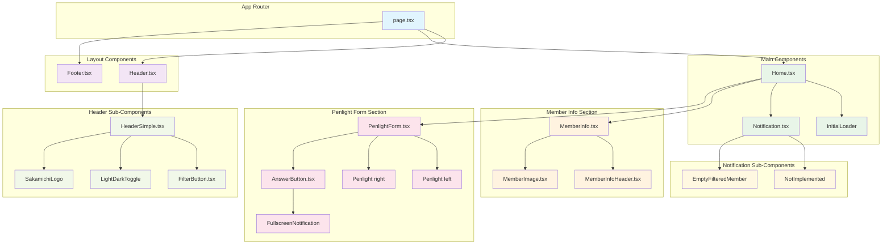
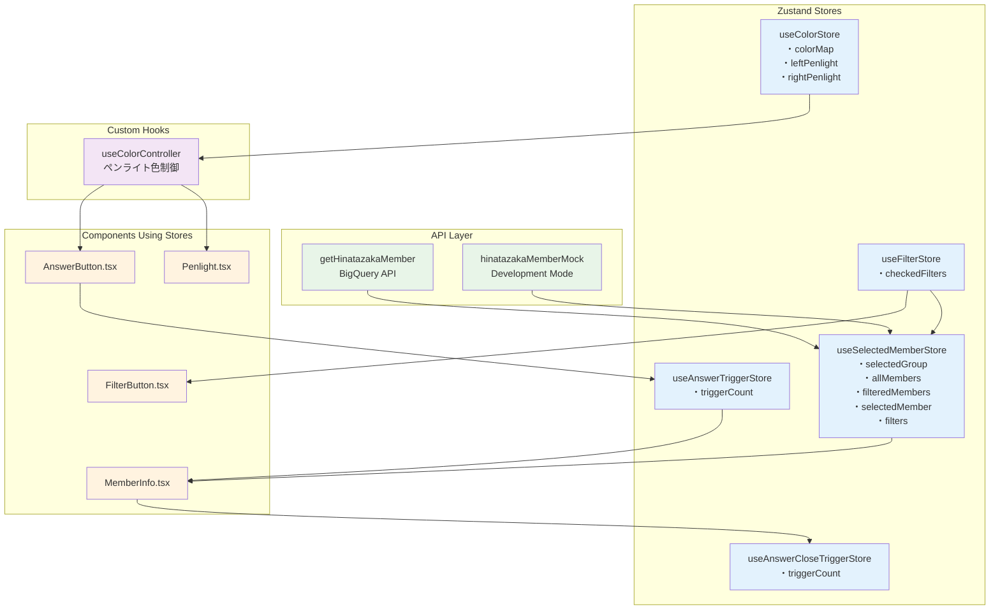
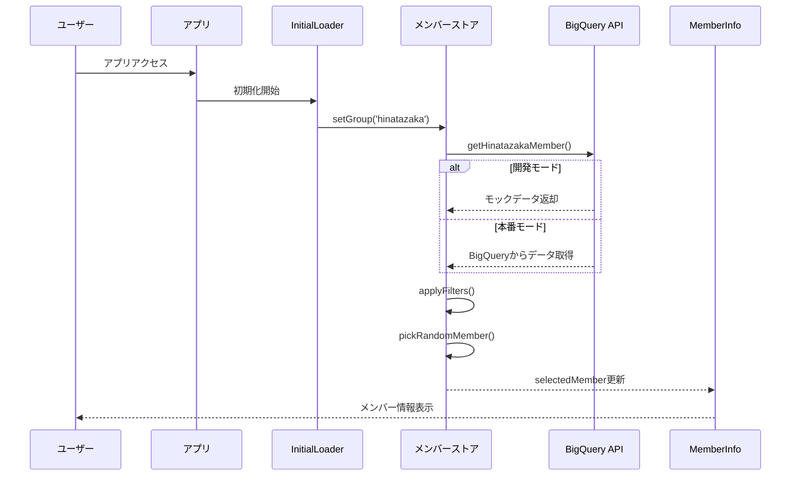
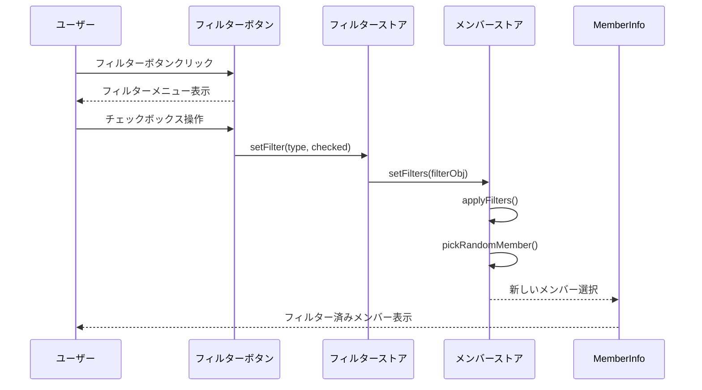
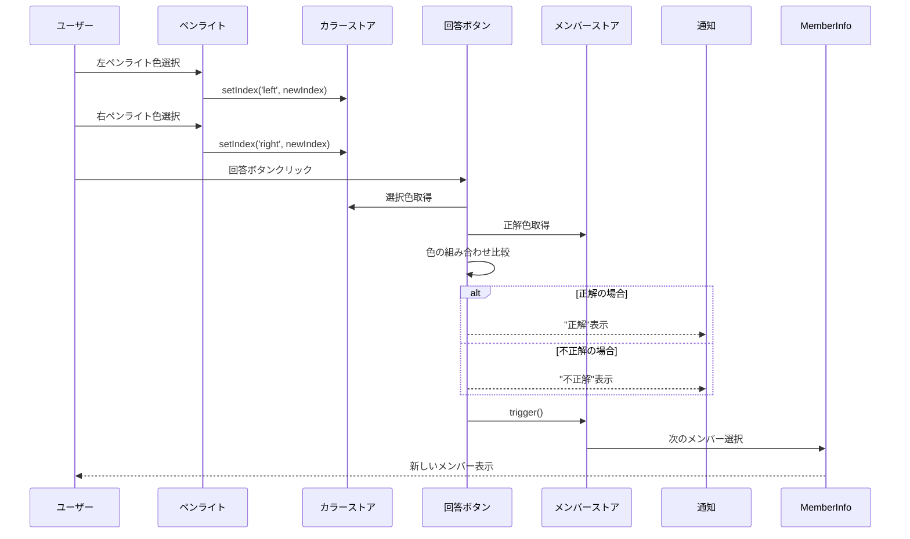
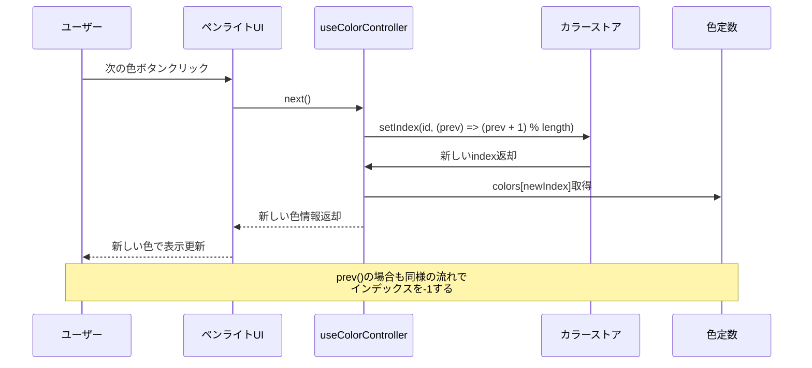
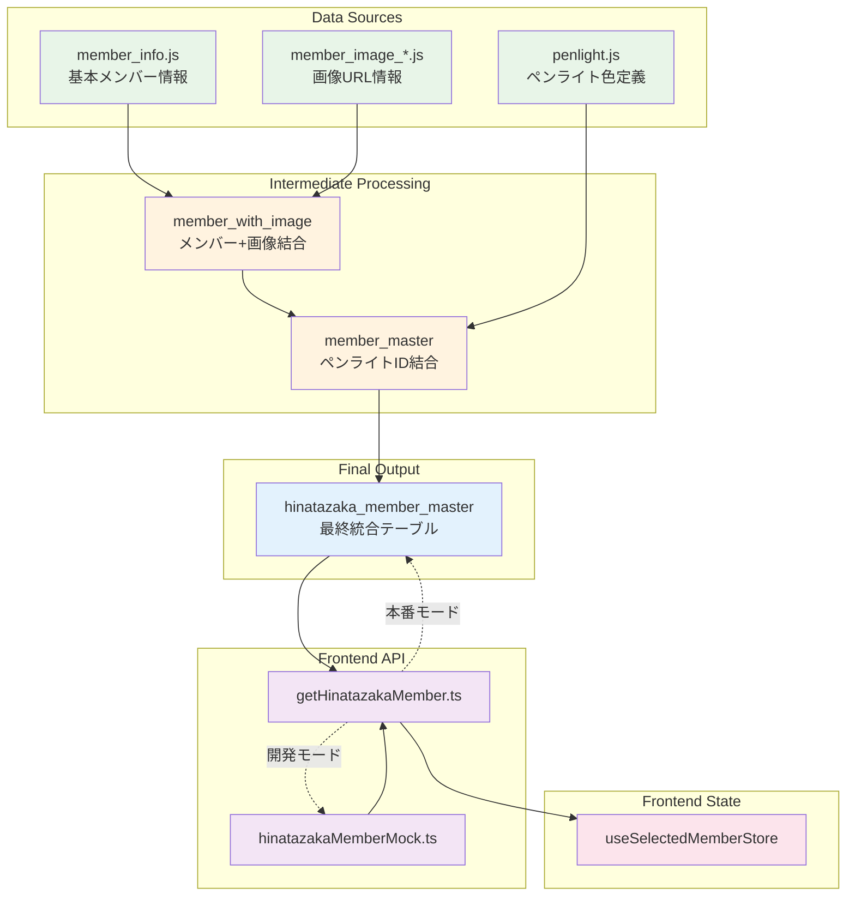

# 坂道ペンライトクイズ - プロジェクト概要

日向坂46のメンバーのペンライト色を当てるクイズアプリケーションです。Next.js 15とBigQueryを使用したモダンなWebアプリケーションです。

## 🎯 アプリケーション概要

### 主な機能
- **ランダムメンバー選択**: 日向坂46メンバーからランダムに選択
- **ペンライトクイズ**: 選択されたメンバーの正しいペンライト色の組み合わせを推測
- **フィルタリング機能**: 期生・卒業状況による絞り込み
- **レスポンシブデザイン**: モバイル優先の縦画面最適化
- **PWA対応**: オフライン機能とアプリライクな体験

### 技術スタック
- **フロントエンド**: Next.js 15 (App Router) + TypeScript
- **UIライブラリ**: Mantine UI v7.17.4
- **状態管理**: Zustand v5.0.3
- **データベース**: BigQuery
- **デプロイメント**: Kubernetes + ArgoCD
- **開発環境**: Docker Compose

## 🏗️ アーキテクチャ概要

### ディレクトリ構成
```
view/                          # Next.jsアプリケーション
├── app/                       # App Routerページ
├── components/                # Reactコンポーネント
│   ├── Header/               # ヘッダー関連
│   ├── Home/                 # メインページ
│   ├── Footer/               # フッター
│   └── Notification/         # 通知コンポーネント
├── stores/                   # Zustand状態管理
├── api/                      # BigQuery API
├── types/                    # TypeScript型定義
└── hooks/                    # カスタムフック

definitions/                   # Dataform SQLクエリ
├── sources/                  # 生データ定義
├── intermediate/             # 中間テーブル処理
└── output/                   # 最終テーブル出力

k8s/                          # Kubernetes設定
├── manifests/                # デプロイメント設定
└── argocd/                   # GitOps設定
```

## 🔄 UIコンポーネント関係図



## 🏪 状態管理アーキテクチャ



## 🎮 ユーザーフロー（シーケンス図）

### 1. アプリケーション初期化フロー



### 2. フィルタリング機能フロー



### 3. クイズ回答フロー



### 4. ペンライト色選択フロー



## 🗃️ データフロー

### BigQuery統合パターン



## 🚀 開発環境セットアップ

### 必要な環境
- Node.js 18以上
- pnpm
- Docker & Docker Compose
- Google Cloud SDK（本番BigQuery接続用）

### ローカル開発

```bash
# リポジトリクローン
git clone [repository-url]
cd sakamichi-penlight-quiz

# 開発環境起動（Docker Compose使用）
make dev

# または手動でNext.js開発サーバー起動
cd view/
pnpm install
pnpm dev
```

### 環境変数

```bash
# 開発モード（モックデータ使用）
NODE_ENV=development

# 本番モード（BigQuery接続）
NODE_ENV=production
GOOGLE_APPLICATION_CREDENTIALS=/path/to/service-account.json
```

### テスト実行

```bash
cd view/
pnpm test        # Jest単体テスト
pnpm test:watch  # ウォッチモード
```

## 🏗️ デプロイメント

### Kubernetes + ArgoCD

```bash
# Kubernetesマニフェスト適用
kubectl apply -f k8s/manifests/main/

# ArgoCD Application作成
kubectl apply -f k8s/argocd/app.yml
```

### Docker Build

```bash
# 本番用イメージビルド
cd view/
docker build -t sakamichi-penlight-quiz .
```

## 📋 主要な型定義

### Member型
```typescript
interface Member {
  id: number;              // メンバーID
  name: string;           // メンバー名
  nickname: string;       // ニックネーム
  emoji: string;          // 代表絵文字
  gen: Generation;        // 所属期生
  graduated: boolean;     // 卒業状況
  penlight1_id: number;   // ペンライト色1のID
  penlight2_id: number;   // ペンライト色2のID
  type: string;           // 画像タイプ
  url: string;            // 画像URL
}
```

### Generation型
```typescript
type Generation = 
  | '1期生' | '2期生' | '3期生' | '4期生' 
  | 'けやき坂46' | 'おひさま'
```

## 🔧 技術的な特徴

### PWA対応
- Service Worker実装
- オフライン機能
- アプリライクなUX
- マニフェストファイルによるインストール可能

### パフォーマンス最適化
- Next.js App Routerの活用
- 画像最適化
- コード分割
- 状態管理の最適化

### モバイル最適化
- レスポンシブデザイン
- タッチインターフェース
- 縦画面優先設計

## 🤝 コントリビューション

1. フォークしてブランチ作成
2. 機能開発・バグ修正
3. テスト実行
4. プルリクエスト作成

### コミット規約
```
feat: 新機能追加
fix: バグ修正
docs: ドキュメント更新
refactor: リファクタリング
test: テスト追加・修正
```

## 📄 ライセンス

MIT License

## 🙏 謝辞

- 日向坂46公式
- Mantine UI
- Next.js Team
- Google Cloud BigQuery

---

> 💡 このプロジェクトは日向坂46ファンによる非公式なファンアプリケーションです。