# 坂道グループペンライトクイズ

[](https://github.com/AobaIwaki123/sakamichi-penlight-quiz/actions/workflows/ci.yml)

Deep Wiki: https://deepwiki.com/AobaIwaki123/sakamichi-penlight-quiz

<div style="display: flex; justify-content: center; gap: 10px;">
  
</div>

## 注意

レスポンシブ対応が苦手すぎて、横画面のレイアウトはかなり崩れています。
是非縦画面で楽しんでください。

## プロジェクト全体アーキテクチャ

```mermaid
graph TB
    subgraph "フロントエンド (Next.js)"
        A[React コンポーネント<br/>view/components/] --> B[Zustand ストア<br/>view/stores/]
        B --> C[API レイヤー<br/>view/api/bq/]
        
        subgraph "主要コンポーネント"
            A1[Home/MemberInfo]
            A2[Header/Footer]
            A3[PenlightForm]
        end
        
        subgraph "状態管理"
            B1[useSelectedMemberStore]
            B2[usePenlightStore]
            B3[useFilterStore]
        end
        
        A --> A1
        A --> A2
        A --> A3
        B --> B1
        B --> B2
        B --> B3
    end

    subgraph "データパイプライン (Dataform)"
        D[ソースデータ<br/>definitions/sources/] --> E[中間処理<br/>definitions/intermediate/]
        E --> F[最終テーブル<br/>definitions/output/]
        
        subgraph "データフロー"
            D1[member_info.js<br/>penlight.js]
            E1[member_with_image.sqlx<br/>member_master.sqlx]
            F1[hinatazaka_member_master.sqlx<br/>sakurazaka_member_master.sqlx]
        end
        
        D --> D1
        E --> E1
        F --> F1
    end

    subgraph "BigQuery"
        G[(sakamichipenlightquiz)]
        G --> G1[(sakamichi dataset)]
        G1 --> G2[hinatazaka_member_master]
        G1 --> G3[sakurazaka_member_master]
        G1 --> G4[hinatazaka_penlight]
        G1 --> G5[sakurazaka_penlight]
    end

    subgraph "デプロイメント"
        H[Kubernetes<br/>k8s/manifests/] --> I[ArgoCD<br/>k8s/argocd/]
        J[Docker<br/>view/Dockerfile] --> H
        
        subgraph "環境"
            H1[dev/]
            H2[main/]
        end
        
        H --> H1
        H --> H2
    end

    C --> G
    F --> G
    A --> J
    I --> K[本番環境]

    classDef frontend fill:#e1f5fe
    classDef data fill:#f3e5f5
    classDef storage fill:#e8f5e8
    classDef deploy fill:#fff3e0
    
    class A,B,C,A1,A2,A3,B1,B2,B3 frontend
    class D,E,F,D1,E1,F1 data
    class G,G1,G2,G3,G4,G5 storage
    class H,I,J,H1,H2,K deploy
```



## BigQueryデータ取得シーケンス図

```mermaid
sequenceDiagram
    participant User as ユーザー
    participant UI as React UI
    participant Store as Zustand Store
    participant API as API Layer
    participant BQ as BigQuery
    participant Mock as Mock Data

    Note over User, Mock: アプリケーション起動・データ取得フロー

    User->>UI: アプリケーション起動
    UI->>Store: useSelectedMemberStore.setGroup('hinatazaka')
    Store->>Store: set({ isLoading: true })
    
    par メンバーデータ取得
        Store->>API: getHinatazakaMember()
        API->>API: Check NODE_ENV
        
        alt 開発モード
            API->>Mock: return hinatazakaMemberMock
            Mock-->>API: Member[]
        else 本番モード
            API->>BQ: CREATE QUERY JOB
            Note over API,BQ: SELECT * FROM sakamichi.hinatazaka_member_master
            BQ-->>API: job.id
            API->>BQ: getQueryResults()
            BQ-->>API: Member[] with penlight_ids
        end
        
        API-->>Store: Promise<Member[]>
    and ペンライト色データ取得
        Store->>Store: usePenlightStore.fetchPenlightColors('hinatazaka')
        Store->>API: getHinatazakaPenlight()
        
        alt 開発モード
            API->>Mock: return hinatazakaPenlightMock
            Mock-->>API: PenlightColor[]
        else 本番モード
            API->>BQ: CREATE QUERY JOB
            Note over API,BQ: SELECT * FROM sakamichi.hinatazaka_penlight
            BQ-->>API: job.id
            API->>BQ: getQueryResults()
            BQ-->>API: PenlightColor[]
        end
        
        API-->>Store: Promise<PenlightColor[]>
    end

    Store->>Store: set({ allMembers, isLoading: false })
    Store->>Store: applyFilters()
    Store->>Store: pickRandomMember()
    Store->>UI: State Update
    UI->>User: メンバー情報表示

    Note over User, Mock: クイズ回答フロー

    User->>UI: ペンライト色選択
    UI->>Store: 回答データと正解チェック
    Store->>Store: penlight_id から色情報解決
    Store->>UI: 正解/不正解結果
    UI->>User: 結果表示

    Note over User, Mock: 次の問題

    User->>UI: 次の問題ボタン
    UI->>Store: pickRandomMember()
    Store->>Store: シャッフル済みリストから次のメンバー選択
    Store->>UI: 新しいメンバー情報
    UI->>User: 新しい問題表示
```



## 技術スタック

- **フロントエンド**: Next.js 15 (App Router)
- **UI ライブラリ**: Mantine UI v7.17.4
- **状態管理**: Zustand v5.0.3
- **データベース**: BigQuery
- **データパイプライン**: Dataform
- **デプロイ**: Kubernetes + ArgoCD
- **開発**: Docker Compose

## プロジェクト構成

### ディレクトリ構造

```
sakamichi-penlight-quiz/
├── view/                          # Next.jsフロントエンドアプリケーション
│   ├── app/                       # App Router (Next.js 15)
│   │   ├── page.tsx              # ホームページ
│   │   ├── layout.tsx            # ルートレイアウト
│   │   └── error.tsx             # エラーページ
│   ├── components/               # Reactコンポーネント
│   │   ├── Home/                 # メインクイズUI
│   │   │   ├── Home.tsx         # メインコンポーネント
│   │   │   ├── MemberInfo/      # メンバー情報表示
│   │   │   └── PenlightForm/    # ペンライト選択フォーム
│   │   ├── Header/              # ヘッダーコンポーネント群
│   │   ├── Footer/              # フッターコンポーネント群
│   │   └── Error/               # エラーハンドリング
│   ├── stores/                  # Zustand状態管理
│   │   ├── useSelectedMemberStore.ts  # メンバー選択・フィルタリング
│   │   ├── usePenlightStore.ts        # ペンライト色管理
│   │   └── useFilterStore.ts          # フィルター状態
│   ├── api/                     # データ取得API
│   │   └── bq/                  # BigQuery連携
│   │       ├── getHinatazakaMember.ts
│   │       ├── getHinatazakaPenlight.ts
│   │       └── mockData/        # 開発用モックデータ
│   ├── types/                   # TypeScript型定義
│   │   ├── Member.ts
│   │   ├── Group.ts
│   │   └── PenlightColor.ts
│   └── consts/                  # 定数・フィルター定義
│       ├── hinatazakaColors.ts
│       └── hinatazakaFilters.ts
├── definitions/                 # Dataform データパイプライン
│   ├── sources/                 # ソースデータ定義
│   │   ├── hinatazaka/
│   │   │   ├── member_info.js   # メンバー基本情報
│   │   │   ├── penlight.js      # ペンライト色定義
│   │   │   └── member_image_*.js # 画像データ
│   │   └── sakurazaka/          # 櫻坂46データ
│   ├── intermediate/            # 中間処理テーブル
│   │   ├── hinatazaka/
│   │   │   ├── member_with_image.sqlx
│   │   │   └── member_master.sqlx
│   │   └── sakurazaka/
│   └── output/                  # 最終出力テーブル
│       └── sakamichi/
│           ├── hinatazaka_member_master.sqlx
│           ├── hinatazaka_penlight.sqlx
│           ├── sakurazaka_member_master.sqlx
│           └── sakurazaka_penlight.sqlx
├── k8s/                        # Kubernetes設定
│   ├── manifests/
│   │   ├── dev/                # 開発環境
│   │   └── main/               # 本番環境
│   └── argocd/
│       └── app.yml             # ArgoCD Application設定
├── scripts/
│   └── push-to-gcr.sh          # GCRデプロイスクリプト
└── compose.yml                 # Docker Compose設定
```

### 主要コンポーネント

#### データフロー
1. **ソースデータ** (`definitions/sources/`) - 生のメンバー情報・ペンライト定義
2. **データパイプライン** (`definitions/intermediate/`) - Dataformによるデータ加工・結合
3. **BigQueryテーブル** (`definitions/output/`) - フロントエンドが参照する最終テーブル
4. **API層** (`view/api/bq/`) - BigQueryからのデータ取得・モック切り替え
5. **状態管理** (`view/stores/`) - Zustandによるクライアントサイド状態管理
6. **UI層** (`view/components/`) - Reactコンポーネントによる表示

#### 環境別動作
- **開発環境**: `NODE_ENV=development` でモックデータを使用（BigQueryコスト回避）
- **本番環境**: BigQueryに直接接続してリアルタイムデータ取得

## 開発・デプロイ

### ブランチプレビュー機能 🆕

プルリクエストや開発ブランチに対して、自動的にCloud Runでプレビュー環境を作成します。

#### 対応ブランチ
- `feature/**` - 新機能開発
- `fix/**` - バグ修正  
- `refactor/**` - リファクタリング
- `develop` - 開発統合ブランチ
- PR（Pull Request）

#### 自動作成される環境
- **URL例**: `https://penlight-pr-123-xxxxxxxxxx-an.a.run.app`
- **設定**: 開発モード（モックデータ使用）
- **自動削除**: PRクローズ時、ブランチ削除時

#### 使用方法
```bash
# 1. 機能ブランチを作成してプッシュ
git checkout -b feature/awesome-feature
git push origin feature/awesome-feature
# → 自動的にプレビュー環境が作成される

# 2. PRを作成
# → PRコメントにプレビューURLが自動投稿される

# 3. PRをクローズ
# → プレビュー環境が自動削除される
```

詳細は [GitHub Actions ワークフロー](.github/workflows/README.md) を参照してください。

### ローカル開発
```bash
# 開発サーバー起動
cd view/
pnpm dev

# または Docker Compose で起動
docker compose up -d
```

### Cursor Rules 管理

#### 自動更新機能
このプロジェクトでは、PR作成・マージ時にCursor Rulesが自動更新されます：

- **PR作成時**: 変更内容を分析し、Cursor Rules更新の必要性をチェック
- **PRマージ時**: プロジェクト構成の変更に応じて関連rulesファイルを自動更新

#### 手動更新
```bash
# 手動でCursor Rulesを更新
./scripts/update-cursor-rules.sh

# PR番号とラベルを指定して更新
./scripts/update-cursor-rules.sh 123 "minor"
```

#### Cursor Rules構成
- `.cursor/rules/pr-management.mdc` - PR作成・管理ガイドライン
- `.cursor/rules/coding-standards.mdc` - コーディング規約
- `.cursor/rules/frontend-architecture.mdc` - フロントエンド構成
- `.cursor/rules/deployment-infrastructure.mdc` - インフラ・デプロイ設定
- `.cursor/rules/dataform-pipeline.mdc` - BigQueryデータパイプライン
- `.cursor/rules/bigquery-integration.mdc` - BigQuery統合パターン

### GCRへのデプロイ

#### 前提条件
- Docker がインストールされていること
- gcloud CLI がインストールされ、認証済みであること
- GCRへのプッシュ権限があること
- 環境変数 `GCP_PROJECT_ID` が設定されていること

#### スクリプトを使用したプッシュ

```bash
# 基本的な使用方法
./scripts/push-to-gcr.sh <tag> [project-id]

# 例
./scripts/push-to-gcr.sh local
./scripts/push-to-gcr.sh dev-$(git rev-parse --short HEAD)
./scripts/push-to-gcr.sh v1.0.0 my-gcp-project

# 環境変数でプロジェクトIDを設定
export GCP_PROJECT_ID=your-project-id
./scripts/push-to-gcr.sh local
```

#### Makefileを使用したプッシュ
```bash
# ビルドのみ
make build

# 指定タグでGCRにプッシュ
make push-gcr TAG=local
make push-gcr TAG=v1.0.0

# ビルド + プッシュ（一括）
make cd-gcr TAG=local

# タグ未指定の場合、自動的に local-{git-hash} が使用される
make cd-gcr
```

#### 従来のHarborへのプッシュ（下位互換性）
```bash
make build
make tag
make push
make cd  # 一括実行
```

### 認証設定

#### gcloud CLI認証
```bash
# ログイン
gcloud auth login

# プロジェクト設定
gcloud config set project YOUR_PROJECT_ID

# GCR認証設定（自動実行されるので通常は不要）
gcloud auth configure-docker
```

#### 環境変数設定
```bash
# プロジェクトID
export GCP_PROJECT_ID=your-gcp-project-id

# BigQuery認証（開発環境）
export GOOGLE_APPLICATION_CREDENTIALS=/path/to/service-account-key.json
```

## プッシュされたイメージの確認

GCRにプッシュされたイメージは以下のURLで確認できます：
- GCRコンソール: https://console.cloud.google.com/gcr/images/YOUR_PROJECT_ID
- イメージURI: `gcr.io/YOUR_PROJECT_ID/penlight/prod-view-penlight:TAG`

# 参考

- [メンバーの絵文字一覧](https://w.atwiki.jp/hinatazaka46liveinfo/pages/70.html)
